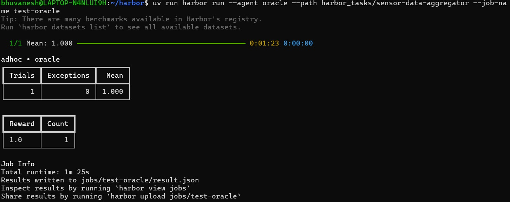
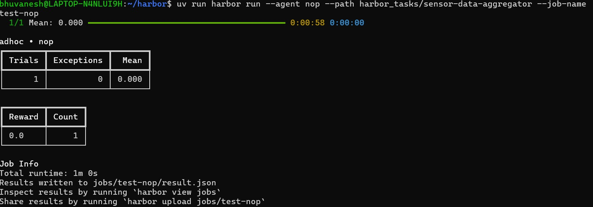
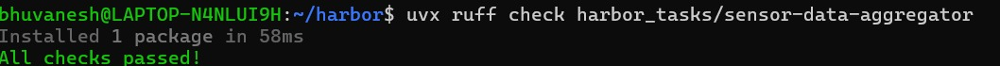

# Harbor Task: sensor-data-aggregator

## Description

This is a Harbor task in the `data-processing` category (difficulty: easy).

The agent is given `/app/input.json`, a JSON array of sensor readings in the form:

```json
[
  {"sensor_id": "s1", "value": 10.0},
  {"sensor_id": "s1", "value": 20.0},
  {"sensor_id": "s2", "value": 5.5}
]
```

The agent must read this file, group the readings by `sensor_id`, and write
`/app/output.json` as a JSON object mapping each `sensor_id` to its:

- `count` — number of readings
- `average` — mean of its readings, rounded to 2 decimal places
- `min` — smallest reading
- `max` — largest reading

The reference solution (`solution/solve.sh`) computes this with a small
Python script — nothing is hardcoded, so the task can be re-verified against
different input data.

## Task structure

```
sensor-data-aggregator/
├── task.toml              # Metadata (difficulty, category, resource limits)
├── instruction.md         # Instructions given to the agent
├── environment/
│   ├── Dockerfile         # Container setup (python:3.13-slim)
│   └── input.json         # Sample sensor readings
├── solution/
│   └── solve.sh            # Reference solution
└── tests/
    ├── test.sh             # Test runner (pytest via uvx)
    └── test_outputs.py     # Test cases — recomputes expected values from
                             # input.json and compares against output.json
```

## How to run it

Prerequisites: Docker running, and [`uv`](https://astral.sh/uv) installed.

Clone [Harbor](https://github.com/laude-institute/harbor), place this folder
at `harbor_tasks/sensor-data-aggregator/` inside it, then from the Harbor
repo root:

```bash
uv sync

# Oracle test — runs the reference solution, should return 1.0
uv run harbor run --agent oracle --path harbor_tasks/sensor-data-aggregator --job-name test-oracle

# NOP test — agent does nothing, should return 0.0
uv run harbor run --agent nop --path harbor_tasks/sensor-data-aggregator --job-name test-nop

# Lint
uvx ruff check harbor_tasks/sensor-data-aggregator
```

## Test results

**Oracle test — reward 1.0**



**NOP test — reward 0.0**



**Ruff lint — all checks passed**


